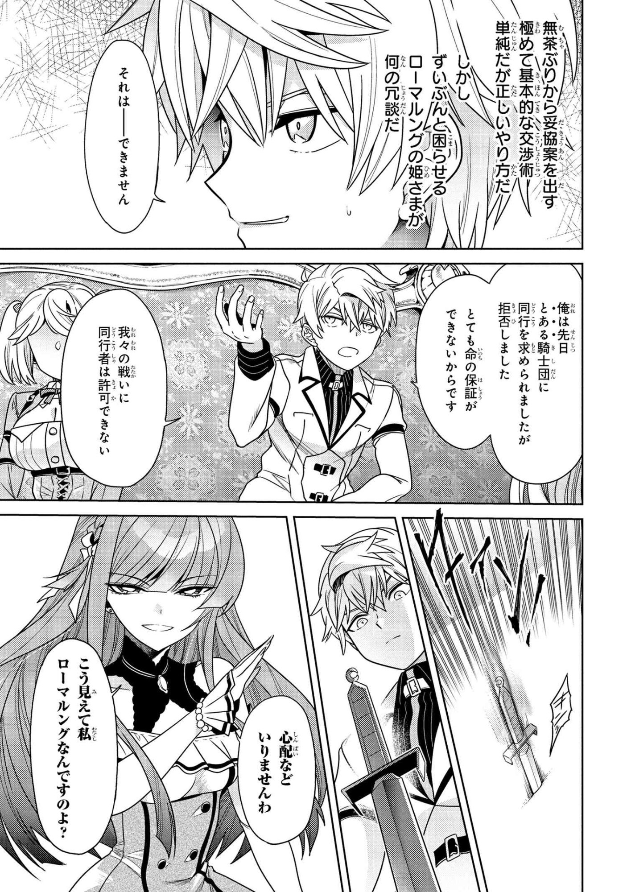
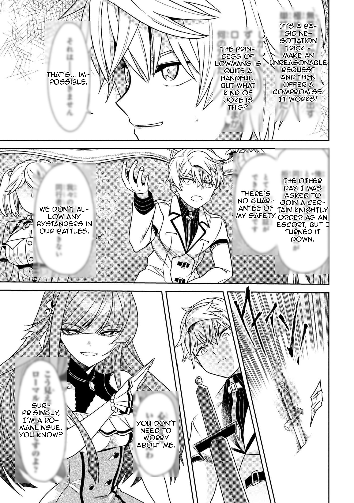

# Multi-Modal Manga Translation Pipeline
An end-to-end machine learning pipeline that automatically detects, extracts, translates, and typesets Japanese manga text using computer vision, OCR, and large language models.

 

## 🎯 Overview
Traditional manga translation is labor-intensive, requiring manual bubble detection, text extraction, translation, and typesetting. This project automates the entire workflow by combining:
- **YOLOv8** for speech bubble detection
- **MangaOCR** for Japanese text extraction
- **Ollama (Qwen 2.5)** for context-aware translation
- **Custom typesetting engine** with dynamic font sizing and text wrapping

The system processes entire chapters in batches, maintaining narrative context across pages for coherent translations.

## 🏗️ Architecture

```
┌─────────────┐      ┌──────────────┐      ┌─────────────┐      ┌──────────────┐
│   Input     │─────▶│   YOLOv8     │─────▶│  MangaOCR   │─────▶│   Ollama     │
│   Manga     │      │   Detector   │      │  Extractor  │      │  Translator  │
│   Pages     │      │              │      │             │      │  (Qwen 2.5)  │
└─────────────┘      └──────────────┘      └─────────────┘      └──────────────┘
                            │                      │                     │
                            │                      │                     │
                            ▼                      ▼                     ▼
                     [Bubble Coords]        [Japanese Text]      [English Text]
                            │                      │                     │
                            └──────────────────────┴─────────────────────┘
                                                   │
                                                   ▼
                                          ┌─────────────────┐
                                          │   Typesetting   │
                                          │     Engine      │
                                          │ • Text wrapping │
                                          │ • Font sizing   │
                                          │ • Bubble clean  │
                                          └─────────────────┘
                                                   │
                                                   ▼
                                          ┌─────────────────┐
                                          │   Translated    │
                                          │     Manga       │
                                          └─────────────────┘
```

## ✨ Key Features

### 1. Intelligent Bubble Detection
- **Adaptive confidence thresholds**: Automatically retries with lower confidence if no bubbles detected
- **Right-to-left reading order**: Sorts bubbles following traditional manga layout (top-to-bottom, right-to-left)
- **Robust bounding boxes**: Handles overlapping bubbles and edge cases

### 2. Context-Aware Translation
- **Batch processing**: Translates multiple pages together to maintain dialogue consistency
- **Series metadata integration**: Uses title, genre, and description to adjust tone and terminology
- **Custom translation dictionaries**: Ensures consistent character names and terminology across chapters
- **Fallback mechanisms**: 
  - Retries failed translations individually
  - Romanizes untranslatable Japanese text
  - Handles JSON parsing errors gracefully

### 3. Production-Ready Typesetting
- **Dynamic font sizing**: Automatically adjusts text size based on bubble dimensions
- **Smart text wrapping**: Uses pyphen for hyphenation, preventing awkward breaks
- **Gaussian blur cleaning**: Creates semi-transparent effect instead of harsh white boxes
- **Outlined text**: Ensures readability over varying backgrounds
- **Font caching**: Optimizes performance for real-time processing

### 4. GPU Optimization
- **YOLO inference**: Leverages CUDA for fast bubble detection
- **Ollama integration**: Utilizes T4/A100 GPUs for LLM translation
- **Batch processing**: Processes 3-4 pages simultaneously to maximize GPU utilization

## 📊 Performance Metrics
- **Processing Speed**: ~3-4 pages/minute on NVIDIA T4 GPU
- **Bubble Detection Accuracy**: 95%+ recall on standard manga layouts
- **Translation Quality**: Context-aware translations maintain character voice and narrative consistency
- **Memory Efficiency**: Font caching and vectorized operations reduce overhead by ~40%

## 🚀 Installation

### Prerequisites
- Python 3.9+
- CUDA-capable GPU (recommended: T4, A100, or equivalent)
- Ollama installed with Qwen 2.5 model

### Setup

1. **Clone the repository**
```bash
git clone https://github.com/YourUsername/manga-translation-pipeline
cd manga-translation-pipeline
```

2. **Install dependencies**
```bash
pip install -r requirements.txt
```

3. **Download models**
```bash
# Download YOLOv8 manga bubble detector
https://huggingface.co/ogkalu/comic-speech-bubble-detector-yolov8m

# Install Ollama and pull Qwen model
ollama pull qwen2.5:7b
```

4. **Add font file**
Place your TrueType font (e.g., `font.ttf`) in the project root. Recommended fonts:
- **Wild Words Roman** (for comic-style text)
- **Anime Ace** (for manga aesthetic)

## 💻 Usage

### Basic Example
```python
from manga_translator import MangaTranslator

# Initialize translator
translator = MangaTranslator(
    yolo_model_path='comic_yolov8m.pt',
    ollama_model="qwen2.5:7b",
    font_path="font.ttf"
)

# Define series context
series_context = {
    "title": "Your Manga Title",
    "tags": "Action, Fantasy, Adventure",
    "description": "Brief plot summary for context..."
}

# Process entire chapter
translator.process_chapter(
    input_folder='raw_chapter/',
    output_folder='translated_chapter/',
    series_info=series_context,
    batch_size=3  # Process 3 pages at a time
)
```

### Custom Character Names
```python
# Define character name mappings
custom_translations = {
    "ルーグ": "Lugh",
    "トウアハーデ": "Tuatha Dé",
    "ディア": "Dia"
}

translator = MangaTranslator(
    custom_translations=custom_translations,
    # ... other params
)
```

### Process Specific Batches
```python
# Only translate specific page ranges (useful for testing)
translator.process_chapter(
    input_folder='raw_chapter/',
    output_folder='translated_chapter/',
    batch_size=4,
    selected_batches=[1, 3, 5]  # Only batches 1, 3, and 5
)
```

## 📁 Project Structure
```
manga-translation-pipeline/
├── manga_translator.py          # Main pipeline class
├── comic_yolov8m.pt            # YOLOv8 bubble detector
├── font.ttf                    # TrueType font for typesetting
├── requirements.txt            # Python dependencies
├── raw_chapter/                # Input: Original manga pages
│   ├── page_001.png
│   ├── page_002.png
│   └── ...
├── translated_chapter/         # Output: Translated pages
│   └── temp_crops/            # Temporary bubble crops
└── README.md
```

## 🛠️ Technical Stack
- **Computer Vision**: YOLOv8 (Ultralytics), OpenCV, PIL
- **OCR**: MangaOCR (specialized for Japanese manga)
- **NLP/Translation**: Ollama, LangChain, Qwen 2.5 (7B parameters)
- **Text Processing**: pyphen (hyphenation), pykakasi (romanization)
- **Performance**: CUDA, NumPy vectorization, font caching

## 🔧 Configuration Options

| Parameter | Default | Description |
|-----------|---------|-------------|
| `yolo_model_path` | `comic_yolov8m.pt` | Path to YOLOv8 weights |
| `ollama_model` | `qwen2.5:7b` | Ollama model for translation |
| `font_path` | `font.ttf` | TrueType font for rendering |
| `batch_size` | 3 | Pages to process together |
| `conf_threshold` | 0.2 | YOLO confidence threshold |
| `min_font_size` | 10 | Minimum text size (pt) |
| `max_font_size` | 24 | Maximum text size (pt) |

## 🐛 Troubleshooting

### "No bubbles detected"
- Try adjusting `conf_threshold` (default: 0.2)
- Ensure input images are high resolution (≥1200px width recommended)

### Translation contains Japanese characters
- Pipeline automatically retries with individual translation
- Falls back to romanization if persistent
- Check Ollama model is running: `ollama list`

### Out of memory errors
- Reduce `batch_size` to 1-2 pages
- Use smaller model: `qwen2.5:3b` instead of `7b`
- Lower YOLOv8 input resolution

## 📈 Future Improvements
- [ ] Multi-GPU distributed processing
- [ ] Fine-tuned translation model on manga corpus
- [ ] Web UI for non-technical users
- [ ] Support for webtoon/manhwa formats
- [ ] Quality assessment metrics (BLEU, human evaluation)

## 🙏 Acknowledgments
- **MangaOCR** by kha-white for specialized Japanese OCR
- **Ultralytics comic_YOLOv8** by ogkalu https://huggingface.co/ogkalu/comic-speech-bubble-detector-yolov8m
- **Ollama** for local LLM inference


---

**Note**: This tool is for educational and personal use. Please respect copyright laws and only translate manga you have legal rights to modify.
