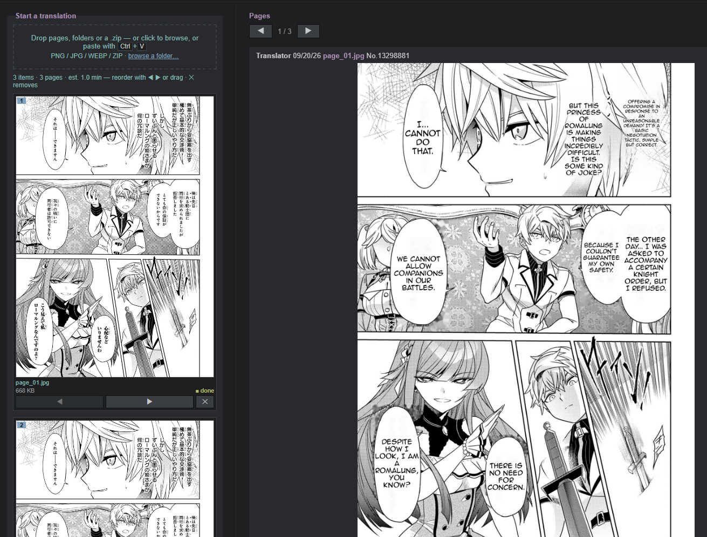
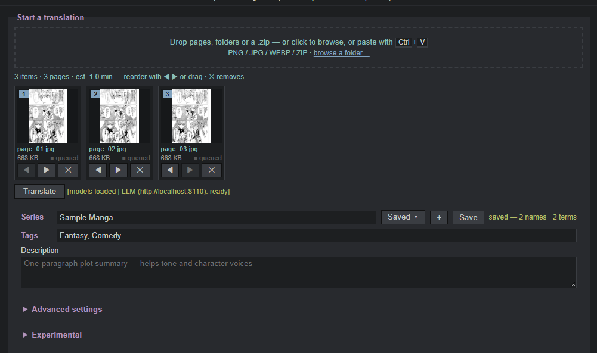
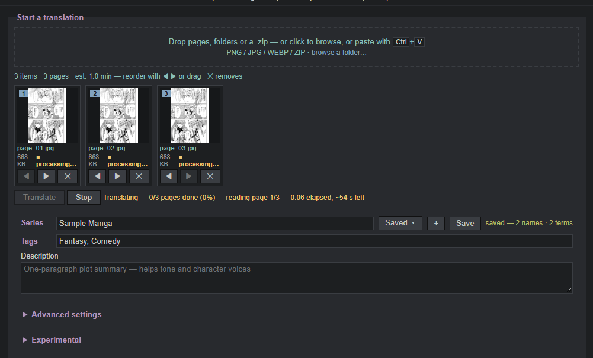
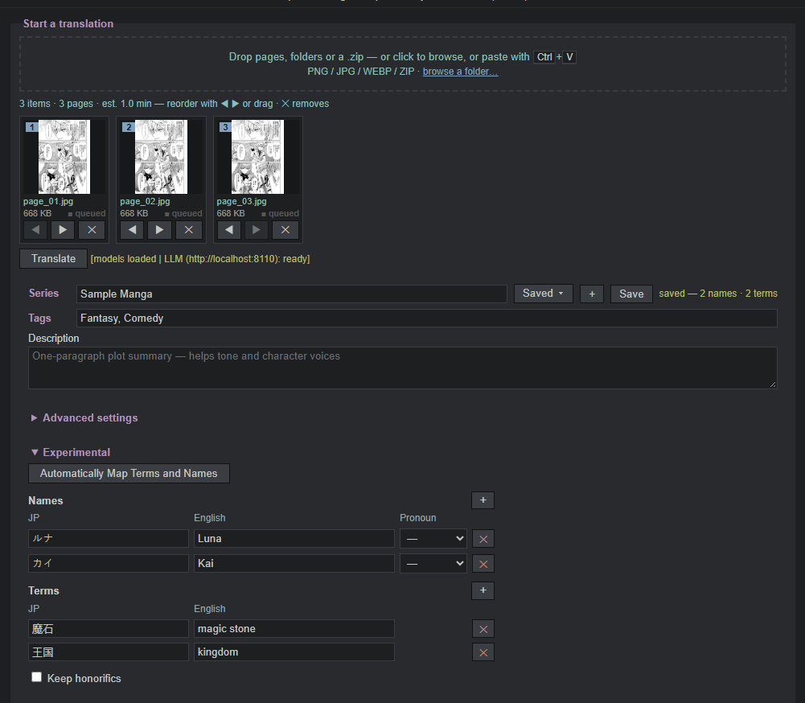

# Multi-Modal Manga Translation Pipeline

Detect, translate and letter Japanese manga pages — **fully local, no paid APIs**. Drop a chapter into the web UI and translated pages come back as they finish.



Under the hood: page image → YOLOv8 bubble detection → manga-OCR → local LLM translation → OpenCV/LaMa cleanup → PIL lettering.

## Features

- **Pages stream in as they finish** — every page appears in the viewer the moment it is lettered, not at the end of the batch. A **Stop** button cancels a run at the next page boundary and keeps whatever already finished.
- **Comparison workspace** — originals on the left as a scrollable rail, single translated page in a sticky viewer on the right, ◀ ▶ buttons or ← → arrow keys to flip.
- **Per-series config, saved and reusable** — series title / tags / description plus **names & terms tables** (JP | EN | pronoun) are stored per series: auto-loaded by title, auto-saved on translate, and updatable any time with an explicit **Save**. **Automatically Map Terms and Names** drafts the tables from the chapter in one click.
- **Fully local end to end** — detection, OCR, cleanup and lettering run on your machine; translation runs against a local llama.cpp server by default. Any OpenAI-compatible endpoint (Ollama, LM Studio, vLLM, hosted APIs) can be used instead from the settings.
- **Lettering that fits** — whole-word wrapping that shrinks instead of hyphenating, dynamic per-bubble sizing, white outline for readability. Extremely tall vertical columns render rotated, reading top-to-bottom.
- **Cleanup comparison sheets** — optional three-panel PNG per page (original | translated | with inpainting) for quick visual checks.
- **Queue niceties** — pages, folders and `.zip` inputs, paste with Ctrl+V, drag/arrow reordering, per-page time estimates learned from your own runs.

## Quickstart

Python **3.10 – 3.12**, Linux / macOS / WSL2 (Windows-native works too). Roughly **10 minutes** end-to-end on a fast connection — the PyTorch wheel is the long pole (a few GB).

```bash
# 1. clone + venv
git clone https://github.com/ArsVie/Multi-Modal-Manga-Translation-Pipeline
cd Multi-Modal-Manga-Translation-Pipeline
python3 -m venv .venv && source .venv/bin/activate      # Windows: .venv\Scripts\activate

# 2. dependencies — install torch FIRST, matching your driver.
#    Pick the right index URL at pytorch.org/get-started/locally (CPU-only: skip --index-url)
pip install torch torchvision --index-url https://download.pytorch.org/whl/cu130
pip install -r requirements.txt

# 3. detector weights (~52 MB)
pip install -U huggingface_hub                          # provides the `hf` CLI
hf download ogkalu/comic-speech-bubble-detector-yolov8m comic-speech-bubble-detector.pt --local-dir .

# 4. lettering font — any comic-style .ttf/.otf, saved as animeace2_reg.ttf in the
#    project root (Anime Ace 2.0 from blambot.com is what the samples use),
#    or point FONT_PATH= at your own file

# 5. an LLM endpoint — ANY OpenAI-compatible server:
#    Ollama already running?   ollama pull gemma3:27b
#        → base URL http://localhost:11434, model name "gemma3:27b" in the web UI
#    llama.cpp?                see "Local LLM server" below (the tuned Gemma 4 26B recipe)
#    hosted API?               paste the base URL, API key and model name in the web UI
#    sanity check: llama.cpp serves /health (200 ready, 503 still loading);
#    anything else is verified through /v1/models automatically

# 6. run
uvicorn server:app --host 0.0.0.0 --port 8000
# open http://localhost:8000, drop pages / a folder / a .zip, hit Translate

# 7. optional: verify the whole setup in one command (translates the bundled sample page)
python scripts/smoke.py
```

First run auto-downloads MangaOCR (~410 MB) and big-lama (~196 MB). Total pipeline footprint ≈ 5 GB + your LLM weights. A CUDA GPU is recommended; CPU-only works — the device auto-detects.

## Web UI



Drop pages, folders or a `.zip` in (or paste with Ctrl+V), hit **Translate** — pages appear in the viewer as they finish, and **Stop** cancels a run and keeps whatever already finished:



After a translation the layout becomes a comparison workspace: **originals on the left** as full-width pages you scroll through, and a **single-page translated viewer on the right** (sticky, fitted to the screen) with ◀ ▶ buttons or ← → arrow keys to flip pages. Queues show the page count and an estimated time (a per-page average learned from your own runs; `.zip` page counts are read from the zip directory).

Series context and the names/terms tables are saved per series — load one from the **Saved ▾** picker, or fill it in and hit **Save**:



Advanced settings (persisted in the browser) cover the LLM server URL / key / model, lettering size, batch size, detection confidence, keep-honorifics and comparison sheets; the custom names map lives in the Experimental section.

For scripting, `POST /translate` (multipart: `files`, plus the same fields) streams NDJSON: one `{"type": "page", "filename", "translated_b64", "comparison_b64"}` line per finished page, then `{"type": "done", "cancelled"}` (or `{"type": "error", "message"}`). `POST /cancel` stops the running job at its next page boundary.

### Python

```python
from MangaTranslator import MangaTranslator

t = MangaTranslator(
    yolo_model_path="comic-speech-bubble-detector.pt",
    font_path="animeace2_reg.ttf",
    llm_base_url="http://localhost:8110",
    custom_translations={"ルーグ": "Lugh"},  # names map, applied before translation
)

t.process_chapter(
    input_folder="raw_chapter/",
    output_folder="translated_chapter/",
    series_info={
        "title": "Sekai Saikou no Ansatsusha",
        "tags": "Action, Fantasy, Romance",
        "description": "One-paragraph plot summary — helps tone and name consistency.",
    },
    batch_size=4,           # pages translated together in one context
    save_comparisons=True,  # also write <page>_comparison.png per page
)
```

## Local LLM server

Translation targets **any OpenAI-compatible endpoint** — llama.cpp, Ollama, LM Studio, vLLM, or a hosted API (paste its base URL + API key + model name in the web UI). The reference configuration this repo is tuned on: Gemma 4 26B-A4B served by llama.cpp (`llama-server`), reasoning off —

```bash
llama-server \
  -m /path/to/gemma-4-26B-A4B-it-UD-Q4_K_M.gguf \
  --mtp-head /path/to/gemma-4-26B-A4B-it-assistant.Q4_K_M.gguf \
  --spec-type mtp --draft-block-size 3 --draft-max 8 --draft-min 0 \
  --cpu-moe -ngl 99 -ngld 99 -fa on -ctk q8_0 -ctv q8_0 -c 32000 --no-mmap \
  --reasoning off --jinja --host 127.0.0.1 --port 8110
```

Qwen3.6-35B-A3B runs the same way (any port; pass it via `llm_base_url`). Check readiness with `curl http://localhost:8110/health` — `200` means the model is loaded, `503` means it is still loading.

Measured on an RTX PRO 1000 8 GB + DDR5 (Gemma 26B-A4B Q4_K_M + MTP): ~17–29 tokens/s generation; a 3-page chapter translates in about a minute.

## Cleanup quality

`save_comparisons=True` (or the web toggle) writes `<page>_comparison.png` — a three-panel sheet for visual regression checks:


*Left: the original. Middle: legacy cleanup (Gaussian blur per bubble). Right: the current default — OpenCV inpainting inside bubbles, LaMa over free text.*

## Configuration

| Parameter | Default | Meaning |
|---|---|---|
| `yolo_model_path` | `comic-speech-bubble-detector.pt` | YOLOv8 weights |
| `llm_base_url` / `llm_model` | `http://localhost:8110` / `local` | LLM endpoint |
| `font_path` | `animeace2_reg.ttf` | typesetting font |
| `custom_translations` | `{}` | JP→EN names/terms map |
| `keep_honorifics` | `False` | re-attach -san / -chan / … when the source has them |
| `device` | auto | `cuda` / `cpu` |
| `debug` | `True` | write `chapter_data.json` next to the output |
| `process_chapter(conf_threshold=)` | `0.15` | YOLO confidence threshold |
| `process_chapter(batch_size=)` | `4` | pages per translation batch |

## Troubleshooting

- **"LLM server ... is not reachable"** — start llama-server first; `curl http://localhost:8110/health` (503 = still loading, 200 = ready).
- **No bubbles detected** — lower `conf_threshold` (e.g. `0.10`).
- **CUDA out of memory** — pass `device="cpu"`, or free VRAM (the LLM server holds ~2.5 GB).
- **Awkward line breaks** — words are kept whole and the font shrinks instead of hyphenating; syllable hyphenation and hard cuts are only last resorts, and names from the custom map are never split.
- **Some sound effects stay Japanese** — the detector only finds bubbles and free text it was trained on; SFX are frequently missed. Expected.

## Known limitations

- The detector was trained on ~8k manga/webtoon/comic pages — unusual layouts can be missed.
- One page group is one LLM call; very large batches can exceed the server context window (`-c`).
- No automatic SFX translation.

## Credits

- Bubble detector: [ogkalu/comic-speech-bubble-detector-yolov8m](https://huggingface.co/ogkalu/comic-speech-bubble-detector-yolov8m) (trainer: ogkalu; stack: ultralytics YOLOv8)
- OCR: [kha-white/manga-ocr](https://github.com/kha-white/manga-ocr)
- Inpainting: [simple-lama-inpainting](https://github.com/enesmsahin/simple-lama-inpainting) (LaMa)
- Font: Anime Ace 2.0 by Blambot (not bundled — available from Blambot)
- Local LLM runtime: [llama.cpp](https://github.com/ggml-org/llama.cpp)

## License

MIT. For educational and personal use. Respect copyright.
